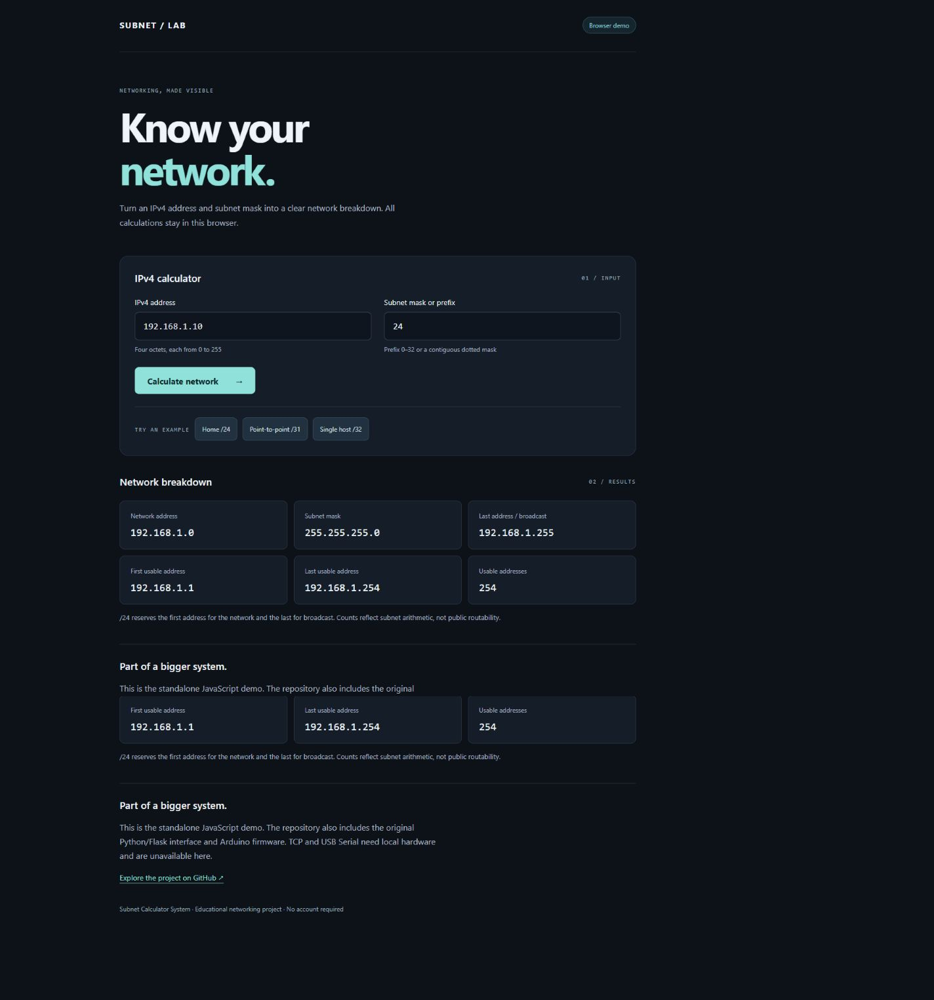
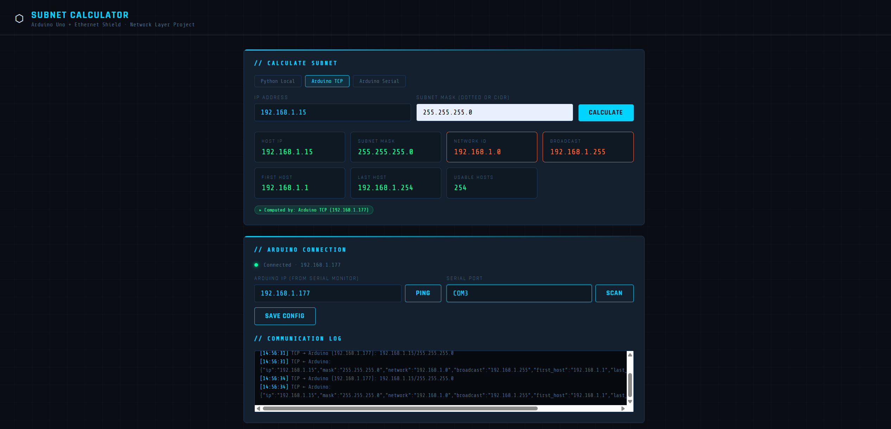

# Subnet Calculator System

An educational IPv4 subnet calculator combining a browser interface, Python/Flask and Arduino TCP/USB Serial communication.

**[Live browser demo](https://Moaz-Mohamed1.github.io/Subnet-Calculator-System/)** · **[Source](https://github.com/Moaz-Mohamed1/Subnet-Calculator-System)**



## Two ways to explore

| Version | Runs where | Hardware needed | Purpose |
| --- | --- | --- | --- |
| Browser demo (`docs/`) | GitHub Pages or a static server | No | IPv4 calculations entirely in JavaScript |
| Flask + Arduino | Your local computer and local network | Only for TCP/Serial modes | Python calculation fallback and original hardware integration |

The public demo has no backend, accounts, tracking scripts, TCP connections or Serial access. It does not run Flask. The Python and Arduino source remains in this repository for local study.

## Calculation behavior

- IPv4 only: four decimal octets from 0 to 255, without leading zeros.
- Accepts `24`, `/24` or a contiguous dotted subnet mask such as `255.255.255.0`.
- Returns the mask, network address, last/broadcast address, first/last usable address and usable-address count.
- `/0` through `/30`: excludes network and broadcast from the usable count.
- `/31`: two usable addresses for point-to-point links; no directed broadcast.
- `/32`: one host; all address fields refer to that address.
- Rejects `/33`, invalid octets, malformed addresses and noncontiguous masks.
- Counts use arithmetic; even `/0` does not allocate billions of addresses. Counts do not imply public routability.

Behavior follows [Python's IPv4 network/host conventions](https://docs.python.org/3/library/ipaddress.html#ipaddress.IPv4Network.hosts). The browser implementation is tested against the Python implementation.

## Run the browser demo

```sh
python -m http.server 8000 --directory docs
```

Open `http://localhost:8000`. No packages or build step are needed.

## Run Flask locally

Requires Python 3.10+.

```sh
python -m venv .venv
# Windows PowerShell:
.venv\Scripts\Activate.ps1
# macOS/Linux: source .venv/bin/activate
python -m pip install -r requirements.txt
python backend/subnet_app_1.py
```

Open `http://127.0.0.1:5000` and choose local calculation mode. The app binds to loopback and runs with debug disabled.

**Local development only:** the legacy device configuration, status and communication routes do not provide authentication or production hardening. Do not expose Flask with port forwarding, a public tunnel or a public server. GitHub Pages publishes only `docs/`.

## Arduino / hardware mode

The original sketch is `arduino/SubnetCalculator.ino`. It uses Arduino Uno, a compatible Ethernet Shield, and the SPI/Ethernet libraries. TCP listens on port **8080**; USB Serial uses **9600 baud**.

Before flashing, set the sketch's static IP, gateway and subnet to match your actual local network; the supplied example IP and gateway are on different /24 networks. Connect the Ethernet Shield for TCP or the USB serial port for Serial, then select/configure the appropriate connection in the local Flask UI.

The original firmware is preserved and has not been compiled or tested on physical hardware in this publication pass. Its parser/host arithmetic is less strict than the Python/browser versions. Flask validates calculation input before forwarding it, and explicitly requires local mode for `/31` and `/32`. Hardware modes require configuration rather than silently falling back to Python. Direct requests to the Arduino bypass the Flask validation.

## Repository layout

```text
docs/                       Standalone public browser demo
backend/subnet_app_1.py      Flask UI, API and local calculation
arduino/SubnetCalculator.ino Original device firmware
screenshots/                Browser previews and original hardware/UI images
tests/test_subnet.py        Validation, API and Python/JavaScript parity tests
requirements.txt            Flask and pyserial dependencies
```

## Tests

```sh
python -m unittest discover -s tests -v
```

Install `requirements.txt` first. Install Node.js to include the browser/Python parity test; without Node, that test is explicitly skipped. Tests cover all 33 prefixes, dotted-mask equivalence, `/31` and `/32`, malformed inputs, invalid API bodies, and 337 browser/Python comparison cases.

## Original project team

- Moaz Mohamed
- Omar Hossam
- Seif Alaa Eldin
- Mostafa Ahmed
- Ahmed Abdelrahman

The existing repository history and original team attribution are retained. No open-source license has been added.

<details><summary>Original Flask interface and hardware</summary>




</details>
