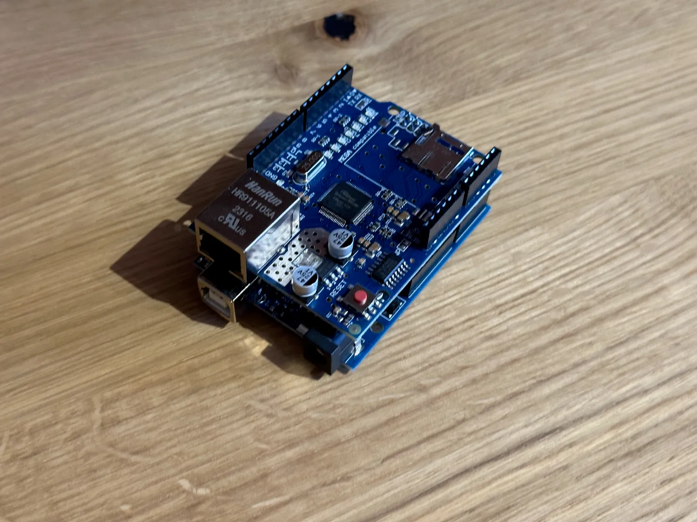

# Subnet Calculator System

A networking and embedded systems project combining Arduino Uno, Ethernet Shield, Python Flask, and TCP/IP communication.

---

## Features
- Subnet calculations
- Network ID & Broadcast calculation
- TCP communication with Arduino
- Serial communication support
- Flask web interface
- Communication logging
- Real-time subnet analysis

---

## Technologies Used
- Python
- Flask
- Arduino Uno
- Ethernet Shield
- TCP/IP
- Socket Programming
- HTML/CSS/JavaScript

---

## System Preview

### Main Interface


### Arduino Hardware


---

## Team Members
- Moaz Mohamed
- Omar Hossam
- Seif Elassal
- Mostafa Ahmed
- Ahmed Abdelrahman

---

## How to Run

### Install Requirements
```bash
pip install -r requirements.txt
```

### Run Flask Backend
```bash
python backend/subnet_app_1.py
```

### Arduino
Upload the Arduino sketch using Arduino IDE.

---

## Project Architecture

User → Flask Web App → TCP Socket → Arduino Ethernet Server
